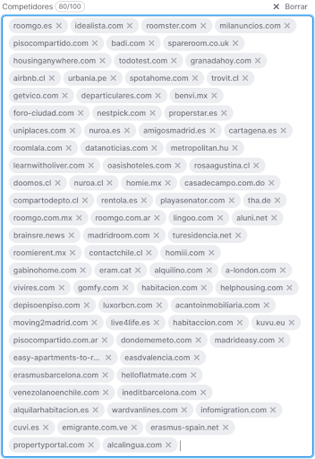
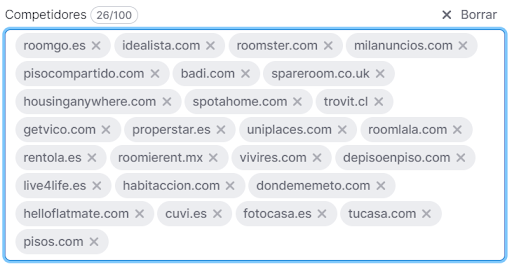
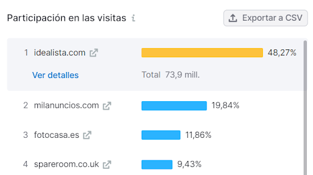
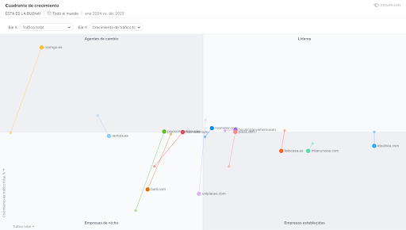
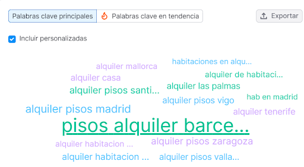
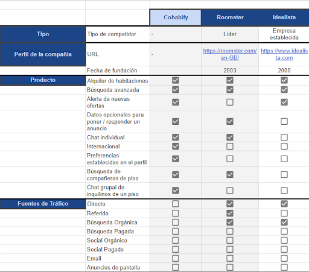

Análisis de competidores
---

<table>
    <tbody>
        <tr>
            <td rowspan=2>Arriaza Arriaza, Daniel 

 Barrera García, Ismael 

 Calero López, Marina 

 Galeano de Paz, Guillermo 

 González Castillero, Rafael 

 Márquez Sierra, María 

 Márquez Soldán, María
            </td>
            <td rowspan=2>Morato Navarro, Juan Carlos 

 Morato Navarro, Olegario 

 Robles Russo, Eduardo 

 Roldán García, Miguel Ángel 

 Romero García, Juan 

 Urquijo Martínez, Álvaro 

            </td>
        </tr>
    </tbody>
</table>

<table>
  <tr>
    <th>Grupo</th>
    <th>4</th>
    <th>Entregable</th>
    <th>S2</th>
  </tr>
  <tr>
    <td>Repositorio</td>
    <td colspan="3"><a href="https://github.com/Cohabify/Cohabify">https://github.com/Cohabify/Cohabify</a></td>
  </tr>
  <tr>
    <td>Base de conocimiento común</td>
    <td colspan="3"><a href="https://bgcc.vercel.app/">https://bgcc.vercel.app/</a></td>
  </tr>
</table>

## Versión Cambios Autores
| Versión | Cambios | Autores |
| --- | --- | --- |
| V1.0 | Creación del documento | - |
| V1.1 | Añadido versionado | Rafael González Castillero |

## Tabla de contenidos
- [Análisis de competidores](#análisis-de-competidores)
- [Versión Cambios Autores](#versión-cambios-autores)
- [Tabla de contenidos](#tabla-de-contenidos)
- [Resumen ejecutivo](#resumen-ejecutivo)
  - [1. Uso de Semrush](#1-uso-de-semrush)
    - [1.1 Identificación de competidores](#11-identificación-de-competidores)
    - [1.2 Perfiles de competidores](#12-perfiles-de-competidores)
    - [1.3 Palabras clave](#13-palabras-clave)
  - [2. Análisis manual de competidores](#2-análisis-manual-de-competidores)

## Resumen ejecutivo
El presente documento pone de manifiesto el análisis de mercado realizado, donde se han estudiado múltiples competidores que podrían ser potenciales amenazas de éxito para nuestra aplicación. No obstante, tras un estudio exhaustivo de las empresas que ofrecen servicios similares a los nuestros, hemos encontrado un gran número de características faltantes que podrían ser explotadas para aportar valor a nuestra aplicación por encima de las demás, lo que nos ofrecería ventajas estratégicas contra la competencia.

### 1. Uso de Semrush

#### 1.1 Identificación de competidores
Para realizar un correcto análisis de competidores, se ha hecho uso de la herramienta Semrush. Esta herramienta, especializada en el estudio de mercado basado en palabras clave de Google y Bing, se utiliza ampliamente en el mundo empresarial para analizar cómo de viable puede ser una idea con respecto a las ya existentes en el mercado. Para ello, se introdujeron los competidores identificados en un principio, que se corresponden con roomgo.com, idealista.com, roomster.com, spareroom.co.uk, milanuncios.com y pisocompartido.com. Luego, mediante una funcionalidad de Semrush, se generaron todos los competidores similares en cuanto a tráfico del último mes, y proporcionó 74 posibles competidores nuevos.

Se han examinado exhaustivamente todos los posibles competidores en búsqueda de incoherencias (como ha sucedido con recomendaciones de competidores que resultaron ser universidades como easdvalencia.com o páginas sociales), con el fin de que permanezcan aquellas afines al público objetivo de Cohabify. También se han descartado páginas web que ofrecen pisos pero no ofrecen la función de alquilar habitaciones.

Tras el filtrado, el análisis de mercado se redujo de 80 dominios a 26. Los dominios resultantes han sido los indicados en la imagen:

#### 1.2 Perfiles de competidores
Con relación al ranking de los competidores, se ha utilizado el proporcionado por la herramienta, estableciendo como 4 competidores directos los siguientes:

Como se evidencia, idealista es la empresa que domina la cuota de mercado en nuestro sector, con casi la mitad del tráfico total. Le siguen milanuncios y fotocasa, que aunque tiene un buen target, es bastante menor que el de idealista. Spareroom, aunque tiene una buena cuota de mercado, se centra en Reino Unido, por lo que podría considerarse como una referencia más que como una amenaza. También se ha utilizado la clasificación que aporta la herramienta para identificar qué perfil juegan los competidores en el mercado. Según el tráfico total que manejan y su crecimiento en el periodo de tiempo seleccionado, podemos catalogarlos por: Agente de cambio, Líder, Empresa de nicho y Empresa establecida. En la siguiente imagen figura la matriz generada por la herramienta:

#### 1.3 Palabras clave
En cuanto a las palabras clave que la herramienta ha detectado, se identifican las siguientes (la opción de palabras clave en tendencia no se ha podido utilizar al pertenecer al plan de pago):

Esto pone de manifiesto que la búsqueda más común es el alquiler en vez de la búsqueda de compañeros, por lo que se ve una notoria escasez de herramientas que se centren no sólo en el lugar de residencia, sino en los compañeros que cohabiten contigo. Lo cual, lleva al surgimiento de la aplicación que ofertamos, con el fin de mejorar la experiencia de los usuarios, donde podrán buscar tanto habitación como visualizar las preferencias de los inquilinos.

### 2. Análisis manual de competidores
Los aspectos que se han analizado de estos dominios son sus datos básicos, como año de fundación o página web, características clave que queremos ofrecer con Cohabify y el flujo de tráfico. Analizar estos datos proporciona información como la experiencia en el mercado de los competidores según su año de fundación y las estrategias que son efectivas a la hora de poner la aplicación en producción. Adicionalmente, la indicación de la página web proporciona fácil acceso a futuras comparaciones y a referencias visuales en el diseño, además de ser un elemento fundamental en la era digital. 

Para reflejar el análisis completo, se ha creado un documento Excel donde se han situado todos los competidores y se han comparado con Cohabify (mostrada la primera). En la siguiente figura, podemos observar un fragmento de la tabla completa:
