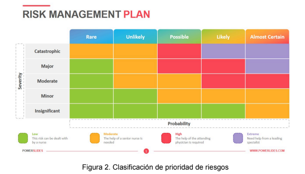

Análisis de Riesgos
---

<table>
    <tbody>
        <tr>
            <td rowspan=2>Arriaza Arriaza, Daniel 

 Barrera García, Ismael 

 Calero López, Marina 

 Galeano de Paz, Guillermo 

 González Castillero, Rafael 

 Márquez Sierra, María 

 Márquez Soldán, María
            </td>
            <td rowspan=2>Morato Navarro, Juan Carlos 

 Morato Navarro, Olegario 

 Robles Russo, Eduardo 

 Roldán García, Miguel Ángel 

 Romero García, Juan 

 Urquijo Martínez, Álvaro 

            </td>
        </tr>
    </tbody>
</table>

<table>
  <tr>
    <th>Grupo</th>
    <th>4</th>
    <th>Entregable</th>
    <th>S2</th>
  </tr>
  <tr>
    <td>Repositorio</td>
    <td colspan="3"><a href="https://github.com/Cohabify/Cohabify">https://github.com/Cohabify/Cohabify</a></td>
  </tr>
  <tr>
    <td>Base de conocimiento común</td>
    <td colspan="3"><a href="https://bgcc.vercel.app/">https://bgcc.vercel.app/</a></td>
  </tr>
</table>

## Versión Cambios Autores

| Versión | Cambios | Autores |
| --- | --- | --- |
| V1.0 | Creación del documento | - |
| V1.1 | Añadido versionado | Rafael González Castillero |

## Tabla de Contenidos
- [Análisis de Riesgos](#análisis-de-riesgos)
- [Versión Cambios Autores](#versión-cambios-autores)
- [Tabla de Contenidos](#tabla-de-contenidos)
- [Resumen ejecutivo](#resumen-ejecutivo)
- [1.1 Identificación](#11-identificación)
- [1.2 Análisis y Priorización](#12-análisis-y-priorización)
- [1.3 Evasión y Mitigación](#13-evasión-y-mitigación)
- [1.4 Monitorización](#14-monitorización)
- [1.5 Resultado](#15-resultado)
  - [1.5.1 Clasificación de impacto y probabilidad](#151-clasificación-de-impacto-y-probabilidad)
  - [1.5.2 Riesgos y planes de contingencia](#152-riesgos-y-planes-de-contingencia)

## Resumen ejecutivo
Este documento detalla cómo se han analizado y evaluado los riesgos en el proyecto de Cohabify.
Se han seguido, hasta este momento, 3 de los 4 pasos principales relativos a la gestión de riesgos: Identificación, Análisis y Priorización, y Evasión y Mitigación. El cuarto paso, Monitorización, no se puede poner en práctica dado que aún no ha surgido ninguno de los riesgos analizados y, por lo tanto, aún no se ha aplicado ningún plan de contingencia para monitorizar.
En general se ha seguido el siguiente proceso: búsqueda de riesgos potenciales, análisis y clasificación de los riesgos encontrados, análisis de impacto de los riesgos, asignación de factores de riesgo y creación de un plan de contingencia.
A continuación, una tabla resumen con los riesgos identificados:

| Problema | Prioridad | Plan de Contingencia |
| --- | --- | --- |
| Desconocimiento de tecnologías | Alta | Formación |
| Estimaciones inexactas | Moderada | Volver a realizar de forma detallada |
| Rendimiento bajo de miembro | Alta | Exigencia y monitorización |
| Conflictos internos | Alta | Toma de decisiones por Group Managers. |
| Testing revela muchos defectos | Baja | Refactorización |
| Falta de estándares | Baja | Adoptar estándares |
| Mala adaptación al sistema pseudo-jerárquico | Moderada | Rotación de roles o equipos |
| Necesidad de Integración Continua | Baja | Automatización de esos procesos |
| Aparición de nuevo competidor | Moderada | Análisis de mercado y mejora de nuestro producto. |

## 1.1 Identificación
Se han identificado un total de 10 riesgos teniendo en cuenta aspectos cómo el equipo y la coordinación, o las posibles dificultades a afrontar durante el desarrollo del producto.
Los riesgos serían los siguientes:
- R1: Desconocimiento de parte del equipo de las tecnologías.
- R2: Deadlines no alcanzables por estimaciones inexactas.
- R3: Rendimiento por debajo de lo estipulado en el CA.
- R4: Conflictos internos del equipo.
- R5: Falta de comunicación entre los subequipos.
- R6: Testing revela muchos defectos.
- R7: Falta de estándares de código, baja mantenibilidad.
- R8: Mala adaptación al sistema pseudo-jerárquico.
- R9: Falta de automatización de pruebas y despliegue.
- R10: Aparición en el mercado de producto con características similares.

## 1.2 Análisis y Priorización
Tras encontrar los riesgos, el primer paso ha sido analizar la probabilidad que tienen de ocurrir. Para clasificar la probabilidad se ha asignado un valor numérico entre 1 y 5 a cada riesgo, siendo 1 casi improbable y 5 casi asegurado.
En segundo lugar se ha analizado el impacto que tendrían sobre el proyecto en caso de suceder. Similarmente, se ha clasificado mediante un valor numérico entre 1 y 5, donde 1 significa que afecta mínimamente al proyecto y 5 que podría implicar cambios mayores en el proyecto o su organización.
En base a la probabilidad y el impacto, se ha clasificado cada riesgo mediante un valor cuantitativo que llamaremos factor y un valor cualitativo que llamaremos prioridad. El factor es el producto de impacto y probabilidad, por lo tanto, será un valor numérico entre 1 y 25. La prioridad se ha asignado mediante una tabla como la de la figura 2. Los valores de impacto (severidad) y probabilidad se han traducido, de 1 a 5, en Insignificante, menor, moderado, mayor y catastrófico; y raro, improbable, posible, probable y casi seguro, respectivamente. Así, mediante los valores traducidos buscamos en la tabla la celda correspondiente y asignamos el valor según el color que corresponda, que puede ser verde, para bajo, naranja para moderado, rojo para alto y morado para extremo.

## 1.3 Evasión y Mitigación
En cuanto a los planes de contingencia, se ha seguido un método basado principalmente en la mitigación de los riesgos. En general, se ha optado por rehacer cualquier proceso que haya provocado un problema recogido en los riesgos ó si es de organización, escalar el problema a los Group Manager para que sea resuelto. Estos planes están enfocados a una resolución completa y eficaz de los riesgos, en detrimento del tiempo necesario para ello. Sin embargo, consideramos que el tiempo extra dedicado vale la pena de acuerdo a la aportación de la seguridad de que no se van a volver a repetir dichos riesgos en el futuro.

## 1.4 Monitorización
Si bien es cierto que este proceso aún no se ha aplicado, se ha definido que serán los Group Manager quienes se encarguen de aplicar los planes de contingencia y supervisar el desarrollo de estos. Si fuera necesario, actualizarán los planes de la forma que sea necesario para lograr una correcta resolución de los riesgos del proyecto.

## 1.5 Resultado
### 1.5.1 Clasificación de impacto y probabilidad
| ID | Problema | Probabilidad | Impacto | Factor | Prioridad |
| --- | --- | --- | --- | --- | --- |
| R1 | Desconocimiento de parte del equipo de las tecnologías | 5 | 3 | 15 | Alta |
| R2 | Deadlines no alcanzables por estimaciones inexactas | 2 | 4 | 8 | Moderada |
| R3 | Rendimiento por debajo de lo estipulado en el CA | 3 | 4 | 12 | Alta |
| R4 | Conflictos internos del equipo | 5 | 3 | 15 | Alta |
| R5 | Falta de comunicación entre los subequipos | 3 | 3 | 9 | Moderada |
| R6 | Testing revela muchos defectos | 1 | 4 | 4 | Baja |
| R7 | Falta de estándares de código, baja mantenibilidad | 3 | 1 | 3 | Baja |
| R8 | Mala adaptación al sistema pseudo-jerárquico | 3 | 2 | 6 | Moderada |
| R9 | Falta de automatización de pruebas y despliegue | 1 | 2 | 2 | Baja |
| R10 | Aparición en el mercado de producto con características similares | 1 | 5 | 5 | Moderada |

### 1.5.2 Riesgos y planes de contingencia
| ID | Problema | Plan de contingencia |
| --- | --- | --- |
| R1 | Desconocimiento de parte del equipo de las tecnologías | Formación previa en tecnologías |
| R2 | Deadlines no alcanzables por estimaciones inexactas | Dividir las tareas de forma detallada y realizar las estimaciones con todo el equipo |
| R3 | Rendimiento por debajo de lo estipulado en el CA | Establecer de forma clara lo esperado en el CA y monitoreo del estado por parte de los Group Managers |
| R4 | Conflictos internos del equipo | Delegación de toma de decisiones en Group Managers |
| R5 | Falta de comunicación entre los subequipos | Comunicaciones entre Group Managers para consultar el estado del proyecto |
| R6 | Testing revela muchos defectos | Refactorización de código |
| R7 | Falta de estándares de código, baja mantenibilidad | Definir estándares para el desarrollo de código en la organización |
| R8 | Mala adaptación al sistema pseudo-jerárquico | Selección y/o rotación de Group Managers de forma democrática o nueva distribución de equipos |
| R9 | Falta de automatización de pruebas y despliegue | Realizar la automatización de los procesos |
| R10 | Aparición en el mercado de producto con características similares | Realizar un análisis de mercado y una reunión de emergencia urgente para mejorar el producto |
