Guía de Revision
---

<table>
    <tbody>
        <tr>
            <td rowspan=2> 
 Morato Navarro, Juan Carlos (editor)

Morato Navarro, Olegario (revisor)

Barrera García, Ismael (revisor)

            </td>
        </tr>
    </tbody>
</table>
   
<table>
  <tr>
    <th>Grupo</th>
    <th>4</th>
    <th>Entregable</th>
    <th>S3</th>
  </tr>
  <tr>
    <td>Repositorio</td>
    <td colspan="3"><a href="https://github.com/Cohabify/Cohabify">https://github.com/Cohabify/Cohabify</a></td>
  </tr>
</table>

### Tabla de versiones
| Versión | Cambios | Autores |
| --- | --- | --- |
| V1.0 | Creación del documento | Guillermo Galeano de Paz, Eduardo Robles Russo|
| V2.0 | Actualizado para S3 | Juan Carlos Morato Navarro |

# Tabla de contenidos
- [Tabla de contenidos](#tabla-de-contenidos)
- [Resumen ejecutivo](#resumen-ejecutivo)
- [Guía de Revisión de Software](#guía-de-revisión-de-software)

# Resumen ejecutivo

Para todos los entregables donde se debe presentar el Software, se requiere incluir en la carpeta de documentos del repositorio de Github un documento separado llamado “revision.md”. Este documento debe incluir:
- Un mapeo explícito de los casos de uso a las interacciones en el software que hacen explícito cómo realizar tu caso de uso principal.
- Datos necesarios para realizar la revisión, como: usuarios, contraseñas o ejemplos de conjuntos de datos de entrada si son complejos, requisitos potenciales para usar el sistema (por ejemplo, “activar la ubicación”) y un enlace a la demostración mostrada en la clase de evaluación y almacenada en una carpeta de demostración dentro de tu repositorio de GitHub.

# Guía de Revisión de Software

  - Un mapeo explícito de los casos de uso a las interacciones en el software que hacen explícito cómo realizar su caso de uso principal:
     -  **Registro**: Desde la pantalla de inicio de sesión aparecerá un link que pone "¿No tienes cuenta?, regístrate." Al pulsar en este se mostrará por pantalla el registro. En este tenemos seis campos, cada uno de ellos con su propia validación. Al modificarlos podremos observar que si lo que hemos metido no es válido se mostrará en rojo. Una vez se han rellenado correctamente los seis campos, marcado el aceptar términos y condiciones y pulsado en siguiente se nos moverá a una segunda pantalla de registro, en la que podremos seleccionar nuestro género, los tags que nos interesen y una foto de perfil. En este punto podremos volver a la pantalla anterior o registrarnos.
      
        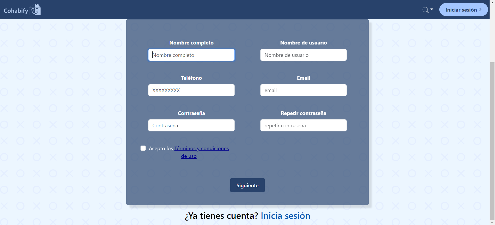
        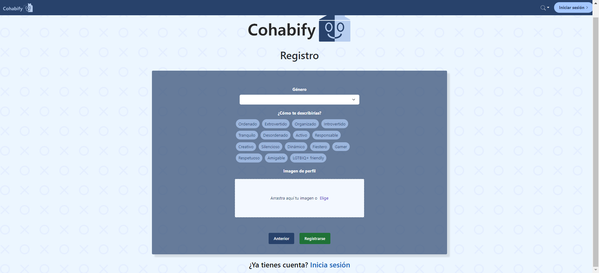
      
    - **Inicio de sesión**: Al iniciar sesión tenemos dos opciones, el inicio de sesión tradicional y mediante google. En la primera opción con introducir los campos de un usuario registrado en el sistema se iniciaría sesión correctamente, apareciendo una pequeña ventana indicando el éxito de la operación.
    - **Inicio de sesión mediante Google**: Es un poco diferente. Al seleccionar el inicio de sesión con la cuenta deseada, se moverá al usuario a una pantalla de registro modificada en la que se requerirán campos no aportados por google o que podrían interesar al usuario cambiar. Estos campos son el nombre completo, el nombre de usuario, el teléfono y el correro, este último campo está deshabilitado y se muestra para que el usuario sepa con qué correo se está haciendo el proceso.
      
        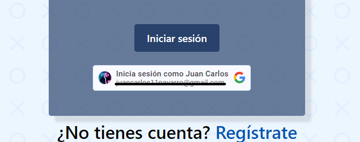
        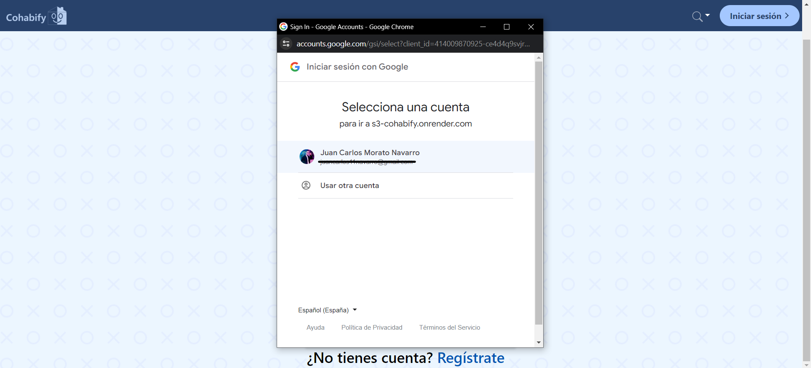
      
    - **Editar perfil**: Una vez que un usuario ha iniciado sesión, puede ver su perfil. Aquí, tienen la opción de editar su perfil. Una vez que han realizado los cambios deseados, pueden guardarlos y su perfil se actualizará.
      
        
        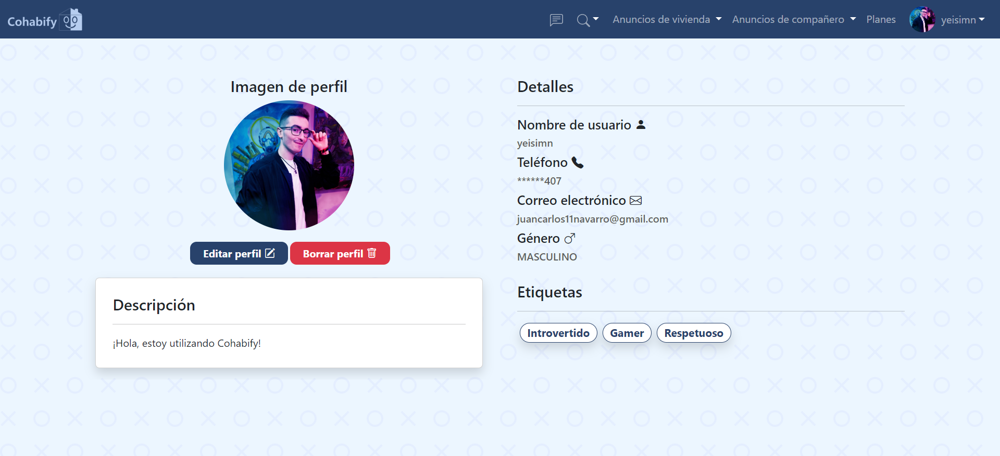
        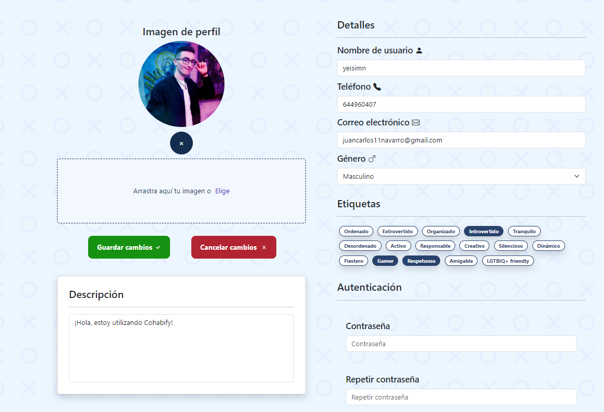
      
    - **Publicar anuncios**: Los usuarios tienen la capacidad de publicar anuncios. Estos anuncios son visibles para otros usuarios en la plataforma. Además de publicar anuncios, los usuarios también pueden editarlos, verlos, marcarlos con “me gusta”, eliminarlos y promocionarlos si así lo desean.
      
        
        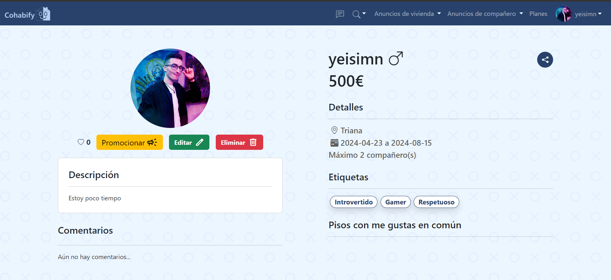
        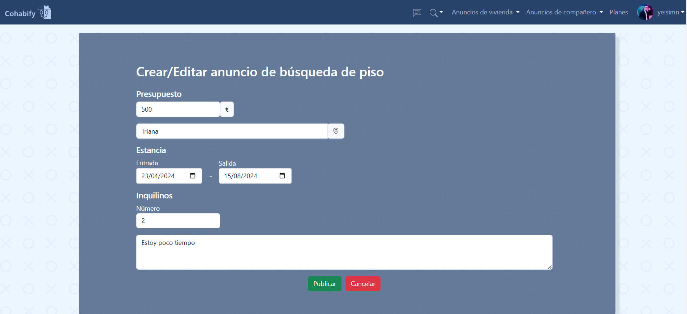
        
        
      
    - **Publicar anuncios de vivienda**:  Los usuarios también pueden publicar anuncios de vivienda. Para hacer esto, deben completar los campos requeridos. Si la vivienda que están anunciando ya está registrada en la base de datos de Cohabify, la información de la vivienda se carga automáticamente, lo que ahorra tiempo al usuario. Para publciar un anuncio de vivienda tienes que estar con el plan de propietario.
      
        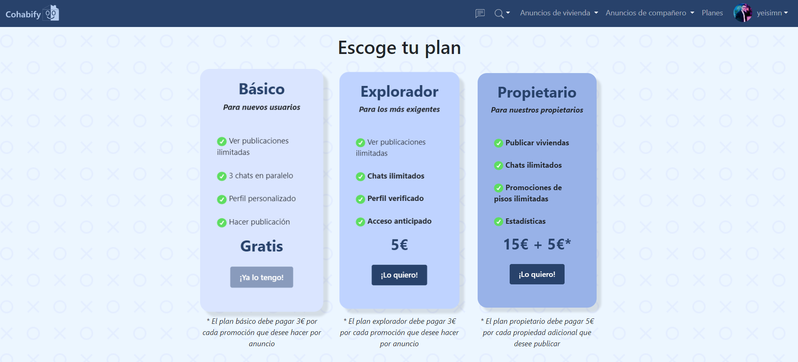
        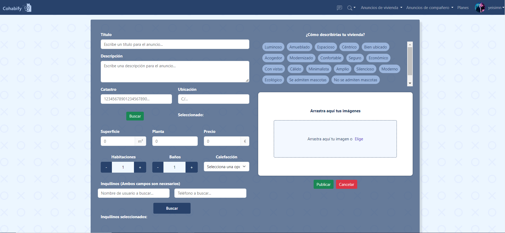
        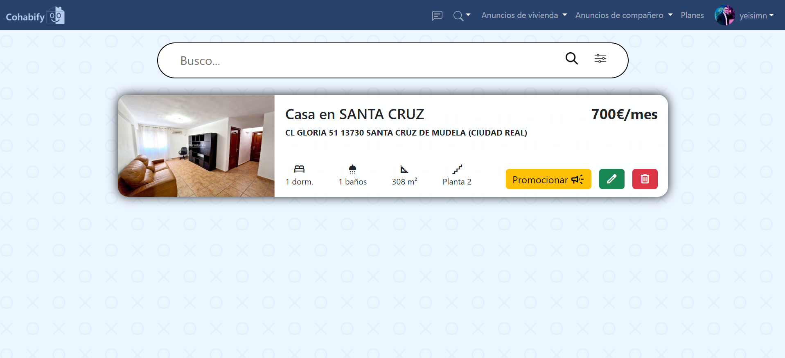
      
    - **Buscar anuncios de vivienda**: Los usuarios pueden buscar anuncios de vivienda en la plataforma. Para ayudarles a encontrar la vivienda que mejor se adapte a sus necesidades, pueden aplicar varios filtros a su búsqueda.
      
        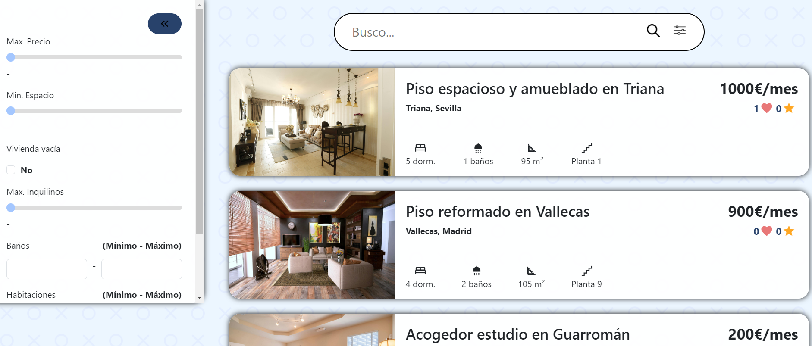
        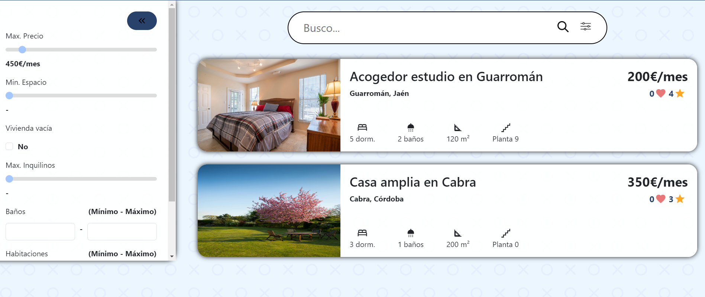
      
    - **Comentar en anuncios de vivienda**: Los usuarios pueden dejar comentarios en los anuncios de vivienda. Estos comentarios son visibles para otros usuarios. Una vez que un usuario ha dejado un comentario, este aparecerá en el anuncio.
      
        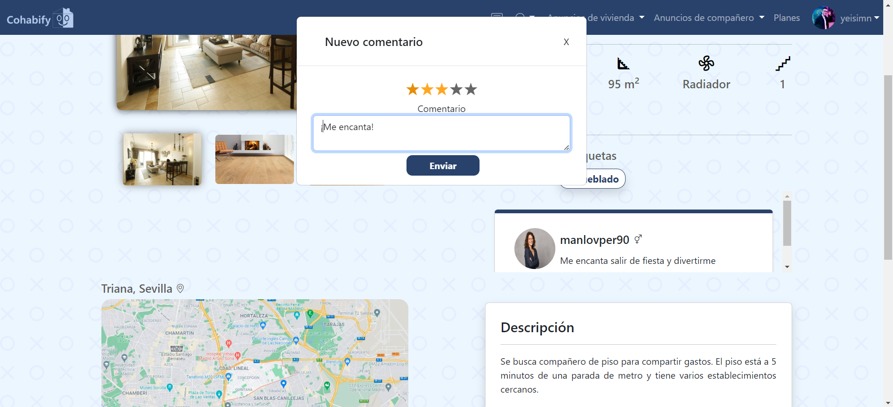
        
      
    - **Ver listado de anuncios de compañeros de piso**: Los usuarios pueden ver un listado de anuncios de compañeros de piso. Al igual que con los anuncios de vivienda, pueden aplicar filtros a su búsqueda para ayudarles a encontrar a la persona adecuada.
      
        
        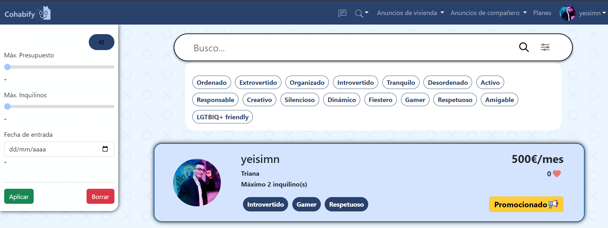
      
    - **Comentar y dar “me gusta” en perfiles de usuarios**: Los usuarios pueden dejar comentarios y dar “me gusta” en los perfiles de otros usuarios. Estas interacciones son visibles para otros usuarios. También podemos eliminar el comentario que hemos puesto.
      
        
        
        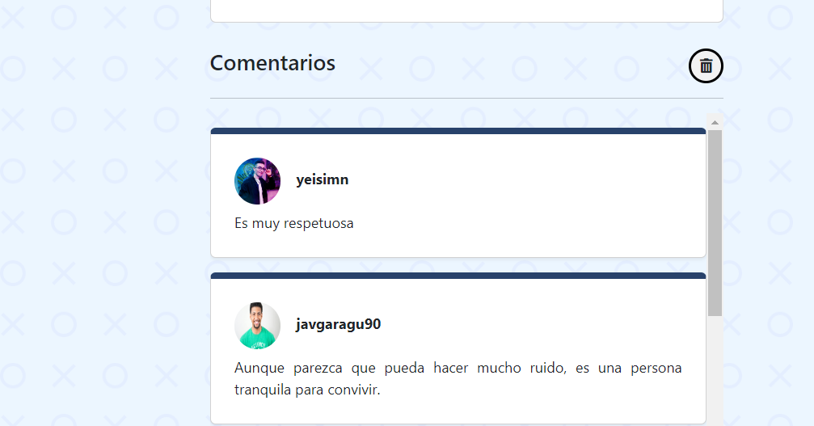
      
    - **Iniciar chat en perfiles de usuarios**: Los usuarios pueden iniciar un chat con los perfiles de otros usuarios. Al pulsar en el botón podemos ver la pantalla de chats, con un listado de contactos a la izquierda y la zona de mensajes a la derecha.
      
        
        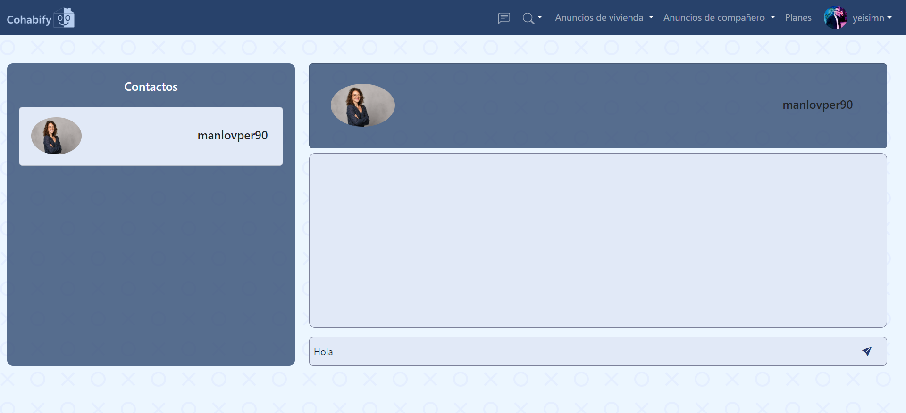
  
      

### Datos necesarios para realizar la revisión, tales como: usuarios, contraseñas, o ejemplos de conjuntos de datos de entrada si son complejos; en particular:

| Información | Detalles |
|-------------|----------|
| URL de la página de inicio | https://cohabify.github.io/ |
| Credenciales de usuarios | Usuarios: **javgaragu90**, **manlovper90** Contraseña: igual al nombre de usuario |
| URL de la plataforma de implementación | https://s3-cohabify.onrender.com/ |
| URL del repositorio de Github | https://github.com/Cohabify/Cohabify |
| URL y credenciales de la herramienta de seguimiento | https://dashboard.bluejay.governify.io/login Usuario: **user** Contraseña: bluejay |
| Requisitos potenciales para usar el sistema | No tenemos requisitos potenciales para usar la aplicación. |
| Enlace a la demostración | https://youtu.be/69Wy7CtNmsY?si=DniGfzxBaX2RU9q6 |
